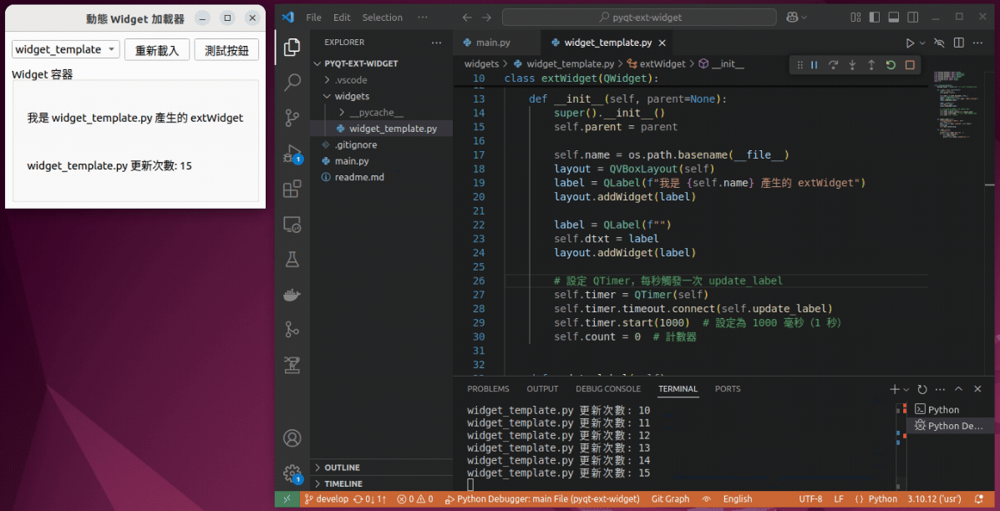
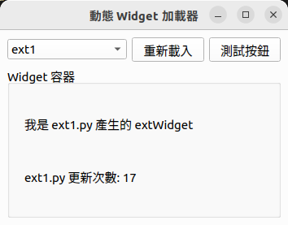
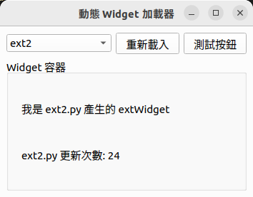

# Readme

## 關於插件

這裡所描述的「插件」指的是一種無需修改主程式即可靈活擴展功能的架構設計。透過插件機制，使用者可以輕鬆地加入新的元件，增強或補充系統功能，同時保持核心程式碼的穩定性與簡潔性。

常見的相關稱呼還包括：

- 插件 (Plugin)
- 擴展模組 (Extension)
- 附加元件 (Addon)

本質上，它們都代表相同概念：讓應用程式具備高度擴充性與彈性，能夠因應不同的需求場景進行功能擴展。

## 技術實現

在 PySide6 應用中，插件的動態載入是透過 Python 標準庫中的 **`importlib` 模組** 搭配 **`hasattr` 函式** 來實現。

- **`importlib`** 允許在程式執行期間，動態匯入指定目錄下的 Python 模組，無需預先寫死匯入的插件列表。

- **`hasattr`** 則用來檢查每個匯入的模組是否包含符合規範的插件模板類別（例如 `extWidget`），確保僅載入符合標準的插件。

在展示中，我複製 `widget_template.py` 成 `ext1.py` 與 `ext2.py`，重新運行 `main.py`，即可自動載入新插件描述的widget，無需更動主程式。

